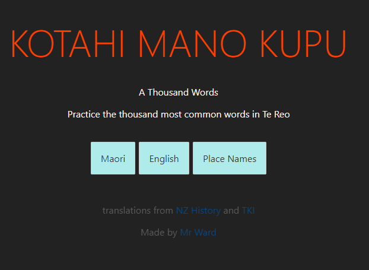
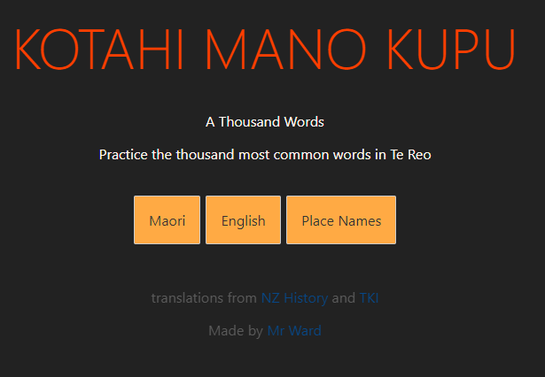

_Name:_ YOUR NAME HERE

_Date:_ 

Involved in the trial
>- Jimmy Jackson
>- Te Kahu
>- Mrs Teacher

## Trial goal:
> To Ensure the main menu screen of our app was intuative to use and aesthetically pleasing, present two colour options. 

## Describe the trail
> We loaded the main menu of our app and asked our 3 candidates to navigate to the game. After this we asked each candidate what they though each button did and if they liked the colour scheme. 

## Results
> - Te Kahu resized the screen causing the image to be laid out in a less desireable layout. 
> - Jimmy was unsure what the difference between the buttons were and was confused by the 3 options. 
> - All candidates knew to push one of the buttons to proceed
> - No one liked the blue colour
> - Mrs Teacher did not understand the title
> - Bug found when buttons are still active after being selected

## Breifly describe the changes you have made based on this trial
> - Planning on changing button wording to "Placenames" and "1000 common words"  
> - include a 'maori \ english' toggle switch
> - Leaving the title as is
> - Fix layout issue with different screen sizes
> - Fix Button bug
> - Go with orange colour